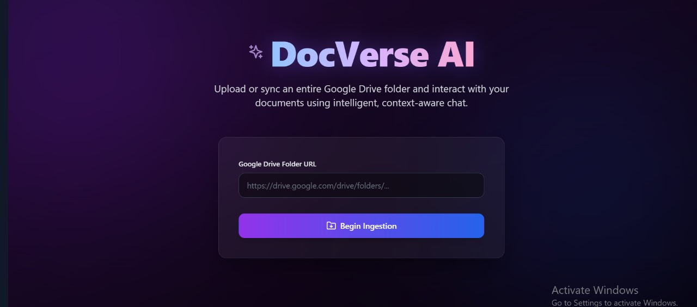
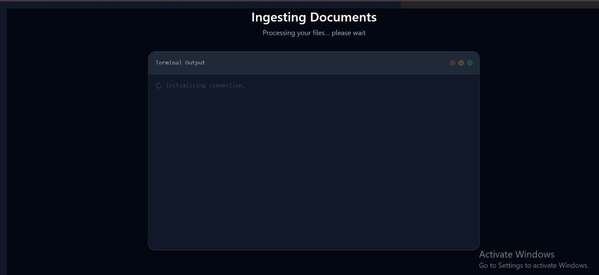
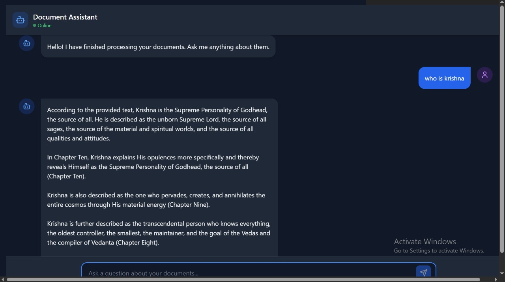

# Personalized RAG-Based Chatbot using Google Drive and ChromaDB

A small Retrieval-Augmented Generation (RAG) project that allows you to create a personalized chatbot by leveraging files stored in a publicly accessible Google Drive folder. The project ingests PDF, PPT, Word, and text files, processes them into embeddings, and enables natural language querying using ChromaDB and Groq API.





---

## Features

- Input a Google Drive folder link (publicly accessible) to automatically fetch documents.
- Supports multiple file formats: PDF, PPT, Word, excel and plain text.
- Documents are chunked and embedded for efficient retrieval.
- Uses **ChromaDB** for vector storage and similarity search.
- Integrated with **Groq API** to generate responses based on retrieved content.
- Creates a personalized chatbot capable of answering questions using your own data.

---

## Tech Stack

- **Language:** Python
- **Frameworks/Libraries:** ChromaDB, Google Drive API, Groq API
- **Databases:** ChromaDB (vector database)
- **File Handling:** PyPDF2, python-pptx, python-docx, standard text handling

---

## Installation

1. Clone the repository:

2. Create a virtual environment and activate it

3. Install dependencies

4. Set up environment variables:

```bash
LLM_API_KEY='xx'
LLM_API_URL='xx'
LLM_MODEL=llama-3.1-8b-instant
```

---

## Usage

1. Provide the public Google Drive folder link when prompted.
2. The system will fetch all supported files from the folder.
3. Files are automatically chunked and converted to embeddings.
4. ChromaDB stores the embeddings for fast similarity search.
5. Ask questions to your personalized chatbot, which uses Groq API and ChromaDB search results to generate answers.

## Supported File Formats

- PDF (`.pdf`)
- PowerPoint (`.pptx`)
- Word (`.docx`)
- Text (`.txt`)
- Excel (`.xlsx`)
